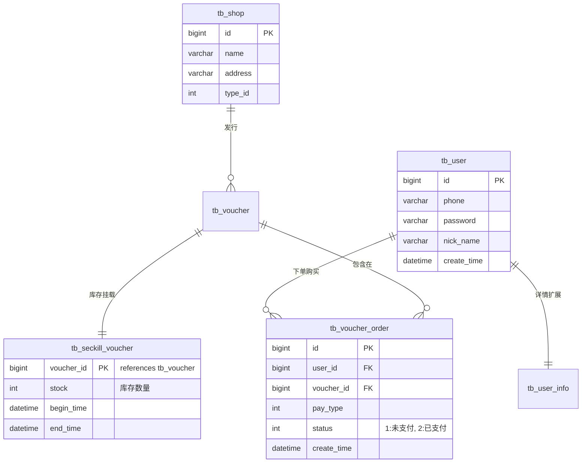

# 数据库 ER 图与表设计

考虑到代码是从黑马点评迁移而来，数据库结构亦完全遵从原有结构。

## ER 图说明

## 数据表定义对等关系
1. `tb_user` & `tb_user_info` (用户表): 系统注册用户、登录状态及业务扩展信息。
2. `tb_shop` & `tb_voucher` (商品表): 作为本系统的“商品主体”，供 C 端消费者浏览并提供详细说明。
3. `tb_seckill_voucher` (库存表): 单独剥离出的秒杀库存管理表，用于承载由于高频秒杀扣减带来的压力。
4. `tb_voucher_order` (订单表): 生成唯一全局 ID 发放的订单表，记录用户与抢购优惠券间的关系。
